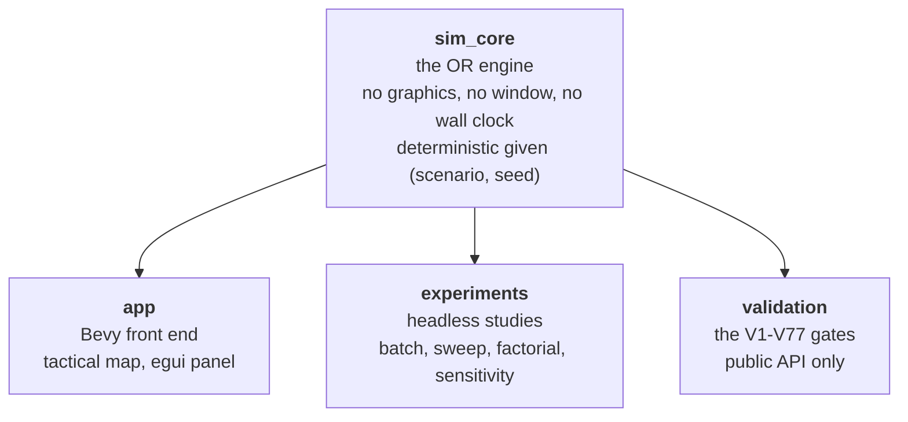
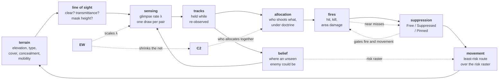
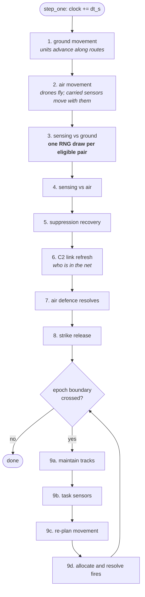
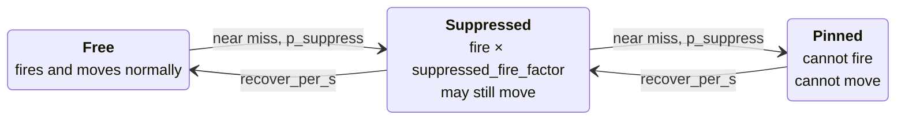
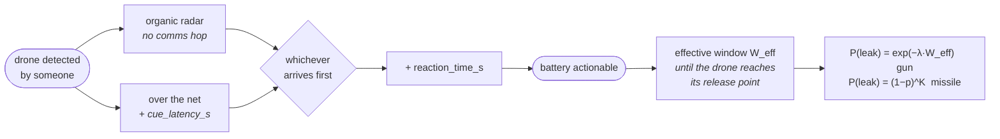

# How the model works

What the pieces are, how they fit together, and what happens when you press play. It assumes
no Rust and no operational research, and every number in it was computed by the real
functions rather than worked out by hand.

This is the explanatory layer. [`docs/GUIDE.md`](GUIDE.md) tells you how to set the thing up
and drive it; [`docs/REFERENCE.md`](REFERENCE.md) is the lookup table of every dial;
[`docs/THEORY.md`](THEORY.md) is where each equation is derived and stated properly. Read this
one first: it is the map the other three hang off.

- [1. The shape of it](#1-the-shape-of-it)
- [2. How the parts couple](#2-how-the-parts-couple)
- [3. Types and placements](#3-types-and-placements)
- [4. One tick, end to end](#4-one-tick-end-to-end)
- [5. Detection](#5-detection)
- [6. Line of sight](#6-line-of-sight)
- [7. Tracks, and why they decay](#7-tracks-and-why-they-decay)
- [8. Choosing a target](#8-choosing-a-target)
- [9. Working out a kill](#9-working-out-a-kill)
- [10. Suppression](#10-suppression)
- [11. Air, and the sensor-to-shooter timeline](#11-air-and-the-sensor-to-shooter-timeline)
- [12. Command, and why it is worth attacking](#12-command-and-why-it-is-worth-attacking)
- [13. Belief, and the value of not seeing](#13-belief-and-the-value-of-not-seeing)
- [14. Movement as a decision](#14-movement-as-a-decision)
- [15. The identity discipline](#15-the-identity-discipline)
- [16. Performance, and why it cannot change
  results](#16-performance-and-why-it-cannot-change-results)
- [17. Where to change things](#17-where-to-change-things)

---

## 1. The shape of it

Four crates, and the arrows only point one way. That is the single most important structural
fact about the project.



**`sim_core` never depends on the app or on Bevy.** That is what allows ten thousand battles
with no window open, and what lets the validation crate check the maths through the public API
alone. A model that cannot be validated from outside has the wrong interface, and putting the
gates in a crate that *cannot* see private state makes that a structural fact rather than an
intention.

Inside `sim_core`, each module owns one idea:

| Module | What it does |
|---|---|
| `terrain.rs` | The map: elevation raster, terrain types, and derived cover / concealment / mobility layers |
| `los.rs` | Line of sight. Walks the grid between two points and reports what it found |
| `sensing.rs` | The detection *rate* model - pure functions, no state |
| `weapon_effects.rs` | Hit probability and area damage - pure functions, no state |
| `suppression.rs` | The Free / Suppressed / Pinned state machine |
| `movement.rs` | Least-risk pathfinding |
| `airframes.rs`, `air_defence.rs` | Drones, and the things that shoot them |
| `ew.rs`, `pomdp.rs` | Jamming, and reasoning about where an unseen enemy might be |
| `game_theory.rs` | The zero-sum game solver |
| `allocation.rs` | Weapon-target assignment: who shoots what |
| `c2.rs` | Command posts: which assets are allowed to coordinate |
| `doctrine.rs` | The kill chain: what a side has been *told* to shoot first |
| `scenario/` | Loading TOML into structs, and refusing what the model cannot run on |
| `sim/` | **The engine that drives all of the above** |

Notice the split. `sensing.rs` and `weapon_effects.rs` are *pure functions*: give them numbers,
they return a probability, with no memory and no randomness. `sim/` is the part that holds state,
owns the dice, and calls them in the right order. **That separation is why the models can be
validated in isolation**, and it is the reason the file layout looks the way it does.

Inside `sim/`:

```
sim/mod.rs          the Sim struct and step_one() - THE TICK. Start here.
sim/state.rs        what a placed unit / sensor / battery / post is
sim/events.rs       the append-only logs of everything that happened
sim/setup.rs        building a Sim and placing assets into it
sim/commands.rs     what the app's mouse can change between ticks
sim/detection.rs    the glimpse process, EW, and the track lifecycle
sim/engagement.rs   ground fires: picking a target, resolving rounds
sim/counter_air/    the air phases: detect, engage, coordinate, strike, damage
sim/tasking.rs      belief, and where each sensor should look next
sim/planning.rs     movement decisions: re-planning a route each epoch
sim/los_cache.rs    a memo (see Performance below); no effect on results
```

**One function is worth reading above all the others: `Sim::step_one` in `sim/mod.rs`.**
Everything else hangs off it.

## 2. How the parts couple

The subsystems are not a list, they are a cycle. This is the diagram to hold in your head:



Read the solid path clockwise and you have the whole model. Terrain decides what can be seen;
line of sight turns that into a sightline fact; sensing turns the sightline into a rate;
tracks turn detections into a picture that decays; allocation turns the picture into a fire
plan; fires turn the plan into casualties and near misses; suppression turns near misses into
units that cannot move; movement takes what is left somewhere else, over ground whose risk is
computed from the enemy's sensors, which puts you back at terrain.

The dotted arrows are the modifiers, and they are where most of the interesting behaviour
lives:

- **EW (Electronic Warfare) scales the detection rate**, and nothing else. It moves nothing and
  hides nothing geometrically. Because tracks are held by rate, that is enough to *break* a track
  and not merely prevent one.
- **EW also shrinks the C2 (Command and Control) net**, using the same jammer with the sign
  reversed: a jammer protecting Red both hides Red units from Blue *and* cuts Blue's own
  coordination.
- **C2 decides who is in whose assignment problem**, so killing a post costs no firepower at
  all and still costs the defence dearly.
- **Suppression gates both fire and movement**, which is what lets artillery shape manoeuvre
  without killing anybody.

Three couplings catch people out, so they are worth stating flat:

**Artillery cannot fire at what nobody is watching.** Indirect fire needs a *track*, not a
sightline. Jam the observer and the guns behind the hill go quiet, while the target is still
perfectly alive. Direct fire is the exact mirror: it needs a sightline and no track at all.

**An unseen enemy still changes where you go.** The movement risk raster is built from the
enemy's *sensor coverage*, not from where the enemy is known to be. Therefore, a sensor placed across
a route changes the route even if it never detects anything.

**Killing the radar blinds the network, not just the battery.** An organic radar is an ordinary
entry in the sensor list, so destroying its battery removes it from every coverage and belief
raster automatically.

## 3. Types and placements

A scenario is a TOML file describing *a situation*: what the ground looks like and who is
standing on it. The split that makes that work is worth understanding before any of the code
makes sense.

- **Libraries** – `units.toml`, `weapons.toml`, `sensors.toml`, `air.toml`,
  `air_defence.toml`, `c2.toml`, `terrain_types.toml` – say **what things are**. One entry per
  type.
- **Scenarios** – `default.toml`, `air_raid.toml` and the rest – say **where things are**. Each
  placement names a `type` from a library.

So `units.toml` declares that an `afv` is three vehicles, 2.8 m tall, carrying an `afv_cannon`;
a scenario says there is one at `[5600, 6400]` following a route. Change `element_count` in the
library and **every** `afv` in every scenario changes. That is the point: the numbers are dials
to be turned, never values baked into code.

A scenario is told apart from a library by *being parseable as a scenario*: it needs a `name`
and a `[terrain]` block, which no library has. There is no hard-coded list of scenario names, so
adding a library never confuses the app's picker or the batch runner.

Every schema sets `deny_unknown_fields`. A misspelt dial is a load error naming the key, not a
silent fallback to the default, which matters more than it sounds, because a scenario that
quietly means something other than what it says produces a finding that can be neither
reproduced nor explained. The value-level twin of that rule is the input contract: a dial the
model *cannot run on* is refused at load too (§7.6 of the theory, gate V67).

### The one seeded generator

Everything random comes from a single seeded `ChaCha8Rng`. Same scenario plus same seed gives
the same battle, down to the last round. No wall clock, no thread-local randomness, no global
state, which is what makes ten thousand trials a measurement rather than an anecdote.

One subtlety decides what an experiment is actually measuring:

- **`Sim::new` derives both the terrain and the dice from the seed.** Looping it over seeds
  varies the map *and* the luck together, so two sources of variance are mixed.
- **`Sim::reset_to_scenario` keeps the terrain and re-rolls only the dice.** That is what is
  wanted for "what happens on *this* map, on average", and what the study harness uses. It is
  also far faster, because building terrain is the expensive part.

Getting this wrong does not produce an error. It produces a confident number that answers a
different question from the one asked.

## 4. One tick, end to end

`Sim::step_one` advances the clock by `dt_s` (default **1 second**) and runs its phases in a
fixed order. Every ten seconds of simulated time – `epoch_s` – a decision block runs as well.



**Two different clocks, and the distinction matters.** The tick integrates things that change
continuously: movement, and the moment-to-moment chance of spotting something. The epoch is
when *decisions* are made: who to shoot, what is still being tracked, where to look, where to
go. Real fire missions are not re-planned sixty times a minute, and separating the two is what
keeps the expensive decision logic off the hot path.

The order inside the epoch is a dependency chain rather than a preference. Tracks are settled
first because everything downstream reads them; tasking follows because it reasons about what
was *not* seen this epoch; movement follows both because a route is planned against what is
currently known about the enemy's sensors; fires come last because they are gated on tracks.

A tick may straddle several epoch boundaries – the loop resolves every one the new time has
crossed – so a coarse `dt_s` cannot silently skip a decision.

**Phases 4, 7 and 8 do nothing at all in a scenario with no aircraft, and consume no
randomness.** That is why adding the air model did not change the results of any existing
ground scenario. §15 is about why that property is enforced rather than hoped for.

## 5. Detection

This is the centrepiece of the tool, so it gets the most space.

### A rate, not a chance

The naive approach would be "each second, roll a die with probability *p* of spotting". The
model computes a **rate**, $\lambda$, in detections per second, and treats spotting as a Poisson
process:

$$
P(\text{spotted within } t) = 1 - e^{-\lambda t}
$$

Why bother? Because a rate is a property of the *situation*, whereas a per-tick probability is
a property of the situation **and the choice of tick size**. With a rate, running at 0.5-second
ticks gives statistically identical results to 1-second ticks. With a per-tick probability,
halving the tick would silently halve the detection rate: the physics would depend on the
integrator, which is the sort of bug that survives for years. Gate V17 checks the identity
exactly.

### The rate, factor by factor

`sensing::detection_rate_against` builds $\lambda$ as a product:

$$
\lambda = \lambda_0 \cdot f(r) \cdot \text{signature} \cdot \tau \cdot (1 - \text{concealment})
$$

| Factor | Meaning | Where it comes from |
|---|---|---|
| $\lambda_0$ | Peak rate: a perfect target at point-blank range | `lambda0_per_s` in `sensors.toml` |
| $f(r) = 1/(1 + (r/r_{1/2})^n)$ | Range falloff | `range_half_m`, `range_exponent` |
| signature | How conspicuous this target is to this sensor | `[unit.signature]`, per modality |
| $\tau = e^{-\kappa L}$ | Canopy transmittance over $L$ metres of foliage | computed by `los.rs` |
| $1 - \text{concealment}$ | Cover from the terrain the target stands *in* | `terrain_types.toml` |

Before any of that, three gates can zero it outright:

1. **Range.** Beyond `max_range_m`, nothing.
2. **Field of regard.** Outside the sensor's arc, nothing. A sensor with no `for_width_deg`
   sees all round.
3. **Line of sight.** Hard-blocked by ground or a building, nothing.

Order matters for speed: the range check is a couple of arithmetic operations, the
line-of-sight walk crosses the whole grid. Therefore, the cheap gates run first.

### Worked example

A `mast_optical` sensor ($\lambda_0 = 0.35$/s, $r_{1/2} = 1800$ m) watching an `afv`
(signature 0.75) at **2000 m**, so $f(2000) = 1/(1 + (2000/1800)^2) = 0.4475$:

| Target situation | $\tau$ | concealment | $\lambda$ (per s) | Mean time to spot | P(spotted in 10 s) |
|---|---|---|---|---|---|
| In the open | 1.0 | 0.0 | 0.1175 | **8.5 s** | 69% |
| Sitting in woods | 1.0 | 0.6 | 0.0470 | **21.3 s** | 37% |
| In woods, seen through 50 m of canopy | 0.018 | 0.6 | 0.00086 | **1162 s** | 0.9% |

Read the last row carefully, because it is the whole argument for modelling terrain properly.
Sitting in woods roughly **doubles** survival time. Sitting in woods *with foliage between the
target and the observer* multiplies it by **137**. Concealment and transmittance are different
things – where a unit stands, against what the sightline passes through – and conflating them
would lose that distinction entirely.

### The code path

```
sim/detection.rs :: detect_units()          for each (sensor, untracked enemy) pair
  └─ Sim::glimpse()                          one pair, one tick
       └─ Sim::effective_rate()
            ├─ sensing::detection_gate()     range / arc / signature → slant range
            ├─ Sim::cached_los()             → los::line_of_sight()
            ├─ sensing::rate_given_los()     the product above
            └─ Sim::jamming_at()             × the EW factor
       └─ if rng.random() < 1 − exp(−λ·dt) → detected
```

**One random draw per eligible pair per tick, in a fixed order.** That is the unit the
determinism guarantee is built on. All detection goes through `Sim::glimpse`, so the
rate, EW and draw logic exist exactly once.

## 6. Line of sight

`los::line_of_sight(terrain, a, h_a, b, h_b)` walks the grid between two points and returns
considerably more than a yes or no:

```rust
LosResult {
    clear: bool,                // any hard block?
    transmittance: f32,         // tau - how much gets through the foliage
    mask_height: f32,           // how much taller the target would need to be to be seen
    blocked_at: Option<f32>,    // how far along the block occurred, if it did
    canopy_length: f32,         // metres of sightline under foliage
}
```

It is rich because the traversal computes all of it anyway, and because sensing needs more than
a boolean. `mask_height` in particular is what makes defilade reasoning possible: "how much
taller would that mast have to be" is answered by the same query that answers "can it see".

**Three heights are kept strictly separate**, and never conflated:

- **Ground elevation** $z$ – the bare earth.
- **Feature height** $f$ – trees and buildings *above* the ground. The blocking surface is
  $z + f$.
- **Actor height** $h$: eye or mast height above the ground beneath it.

As a result, a unit in woods sits at $z + h$, **under** the canopy at $z + f$: it can see out from
beneath its own trees. Urban blocks hard; trees attenuate, accumulating $\tau = e^{-\kappa L}$
over the canopy length crossed.

That third quantity is also why adding aircraft needed no change to this function at all. **An
altitude is just an actor height**, so a drone is an endpoint like any other.

Range is always **slant range**, $\sqrt{\text{horizontal}^2 + \Delta h^2}$, never horizontal. A
drone at 400 m directly overhead is 400 m away, not 0 m. On flat ground with equal heights it
reduces to horizontal distance exactly, which is why adopting it project-wide re-baselined
nothing.

## 7. Tracks, and why they decay

Spotting something once does not mean you keep watching it. A track is **held** only while it
is refreshed, and lapses `track_hold_s` (default **45 s**) after the last observation.

At each epoch, `maintain_tracks` asks whether a sensor would expect to glimpse this target
again during the next epoch:

$$
\text{refresh if } 1 - e^{-\lambda_{\text{eff}} \cdot \text{epoch\_s}} \ge \text{track\_maintain\_p}
$$

Two design points that are easy to miss.

**Maintenance is deterministic.** Acquiring a target is a dice roll; keeping your eyes on
something you have already found is not. No randomness is drawn here, which also means the
per-tick RNG stream is unperturbed by it.

**It uses the *effective* rate, jamming included.** This is what allows electronic warfare to
**break** an existing track rather than merely prevent a new one: jam a sensor hard enough and
$\lambda_{\text{eff}}$ falls below the threshold, and the track ages out even with a clear
view. Before tracks decayed, detection was permanent and jamming an already-spotted unit did
precisely nothing: half the EW model missing rather than a simplification.

## 8. Choosing a target

At each epoch, `sim/engagement.rs :: resolve_fires` runs every live unit through four steps.

**Step 1: can it shoot?** Skipped if dead, if **Pinned** by suppression, or if it carries no
weapon.

**Step 2: allocate targets.** Each side assigns **all** its shooters at once, rather than each
choosing for itself. The payoff for putting shooter $i$ on the $k$-th slot of target $j$ is

$$
q(i,j) \cdot \text{value}(j) \cdot \big(1 - \bar q(j)\big)^{k}
$$

$q$ is the fraction of the target this shooter expects to destroy this epoch, straight from the
fires model below; `value` is what the target is worth; and the last term is diminishing
returns: a second shooter on a target only helps if the first failed. Solved optimally by the
Hungarian algorithm.

Why bother? Because the obvious rule wastes fire in an obvious way: three tanks all engage the
nearest enemy while a second, equally dangerous one is untouched. Set
`[sim] allocation = "independent"` to get that old behaviour back and compare: it costs about
**12.8 seconds** on `fire_allocation`, roughly 17% of the time to clear the enemy.

**Eligibility differs by weapon class, and the difference is the point:**

| | Direct fire | Indirect fire |
|---|---|---|
| Needs line of sight? | **Yes** | No - it arcs over |
| Needs a track? | **No** | **Yes** |
| Rationale | You shoot what you can see | You bombard where you have been *cued* |

That asymmetry is why sensing matters. Artillery cannot fire at what nobody is watching, so a
sensor that loses its track silences the guns behind it.

**Step 3: work out the shot once.** Range, hit probability and dispersion depend only on
shooter, target and weapon, none of which change during the burst. Consequently, they are computed once,
and the round loop only rolls dice.

**Step 4: fire the rounds.**

```
rounds this epoch = round(rof_rounds_per_min × epoch_s / 60) × live elements
```

Note **times live elements**. A unit is not a point; it is *N* sub-elements – three vehicles in
a troop, eight dismounts in a section – and each one shoots. Lose half your strength and you
lose half your output, which is precisely what makes an aimed-fire duel reproduce
**Lanchester's square law**, the strongest single check on the whole attrition chain.

### What a side has been told to shoot first

The allocation above is what an *omniscient optimiser* would do. A gun crew does not hold a
kill-probability table; it holds orders. Therefore, a side may declare a **doctrine** – a priority list
naming asset ids, roles or whole classes – and by default it is **strict**: a shooter that can
reach anything in a higher tier takes it, even at a worse shot than a lower tier offers.

That makes the mode switch a measurement rather than a preference. Strict doctrine against
payoff-optimal allocation puts a number on what *directive control* costs against *optimal
control*, in the same way that `independent` measures what *no* control costs.

Two rules keep a fire plan from becoming a way to waste ammunition. **Range and line of sight
block a pairing rather than merely lowering its score**, so a shooter whose whole top tier is
masked by a ridge falls through to the next tier instead of standing idle facing a hill. And **a
shooter holds its target** until it is dead or unengageable, because otherwise a gun re-decides
every epoch and flip-flops between two near-identical targets as tiny payoff differences wobble.

One measured result is worth knowing because it is not obvious. On `kill_chain`, batteries
killed comes out *lower* under an air-defence-first plan than under an armour-first one. A tank
must be **found** – first detection around 3.5 s – while an emitting battery is locatable from
tick one, so even the armour-first plan opens on the battery because nothing else is visible
yet. **Doctrine ranks what you can see; it cannot rank what you have not found.**

## 9. Working out a kill

### Direct fire

The round scatters as a two-dimensional Gaussian about the aim point, and angular dispersion
becomes linear spread with range: $\sigma(r) = \text{dispersion\_mrad} \times r / 1000$ metres.

The target is a rectangle, `silhouette_width_m` wide and `height_m` tall. Because horizontal and
vertical aiming errors are independent, hitting it is a product of two one-dimensional Gaussian
integrals:

$$
P_{\text{hit}} = \mathrm{erf}\!\left(\frac{W}{2\sigma\sqrt2}\right) \cdot \mathrm{erf}\!\left(\frac{H}{2\sigma\sqrt2}\right)
$$

$$
P_{\text{kill}} = P_{\text{hit}} \times p_{\text{kill|hit}} \times (1 - \text{cover}) \times \text{suppression factor}
$$

For an `afv_cannon` (0.5 mrad, `p_kill_given_hit` 0.7) against an `afv` (3.2 m by 2.8 m):

| Range | $\sigma$ | $P_{\text{hit}}$ | $P_{\text{kill}}$ in the open | $P_{\text{kill}}$ in urban (cover 0.7) |
|---|---|---|---|---|
| 500 m | 0.25 m | 1.000 | **0.700** | 0.210 |
| 1500 m | 0.75 m | 0.907 | **0.635** | 0.191 |
| 2500 m | 1.25 m | 0.589 | **0.413** | 0.124 |

Cover is doing enormous work here: at 1500 m, being in a built-up area cuts lethality by
**70%**: a bigger effect than tripling the range.

### Indirect fire

Two stages. First, where does the round land?

$$
\text{burst} = \text{aim} + N(0, \sigma^2 I), \qquad \sigma = \frac{\text{CEP}}{1.1774}
$$

CEP (Circular Error Probable) is the radius containing half the rounds; the constant is
$\sqrt{2\ln 2}$, the circular-Gaussian identity relating the two.

Second, what does a burst do to something $\rho$ metres away? The **Carleton** damage kernel,
$D(\rho) = \exp(-\rho^2 / 2R_L^2)$, where $R_L$ is the lethal radius. Each surviving element
then rolls independently against $D \times (1 - \text{cover})$, so area fire attrits a group
properly rather than killing all or none.

The expected damage, averaged over where the round actually lands, has a **closed form**: a
Gaussian convolved with a Gaussian:

$$
\mathbb{E}[D](d) = \frac{R_L^2}{\sigma^2 + R_L^2}\exp\!\left(\frac{-d^2}{2(\sigma^2 + R_L^2)}\right)
$$

**That closed form is why this kernel was chosen.** A simpler cookie-cutter lethality disc would
be cheaper, but it has no analytical expectation, so there would be nothing to check the sampler
against, and an unvalidated sampler is exactly what this project exists to avoid.

For a `howitzer_155` (CEP 90 m, so $\sigma = 76.4$ m, $R_L = 40$ m):

| Aim offset | $\mathbb{E}[D]$ per round | Expected casualties per round on a 3-element unit |
|---|---|---|
| 0 m (dead on) | 0.215 | 0.64 |
| 50 m | 0.182 | 0.55 |
| 100 m | 0.110 | 0.33 |
| 200 m | 0.015 | 0.04 |

Even a perfectly aimed 155 mm round expects to kill only **0.2 of an element**, because a 90 m
CEP is large next to a 40 m lethal radius: most rounds land too far away to matter. Artillery
works by volume, and the model says so without being told to.

Contrast a `guided_bomb` (CEP 12 m, $R_L$ 45 m): $\mathbb{E}[D](0) = 0.951$. Precision changes
the kill mechanism entirely: one munition instead of a fire mission. Both use the *same* code
path; only `cep_m` differs.

**An anti-radiation missile is this with one extra decision.** A weapon flagged
`anti_radiation` uses `cep_m` against a transmitting radar and `silent_cep_m` against a silent
one, so its accuracy is bought with the target's own emissions. It is a dispersion rather than a
veto: the munition still arrives, it just flies to where the emitter was last known to be.

## 10. Suppression

A three-state machine per unit: Free, Suppressed, Pinned. Near misses – a round landing within
`suppression_radius_m`, default 35 m, that does *not* kill – push the state up with probability
`p_suppress`. Time pushes it back down at `recover_per_s`.



This is what lets fires **shape manoeuvre without killing anybody**, which is most of what
artillery is actually for. It is a discrete state rather than a scalar multiplier precisely
because it gates behaviour discontinuously, and because a birth-death chain hands over its
stationary distribution and its mean recovery time as closed forms to gate against.

One simplification worth knowing: **direct fire treats every miss as a near miss**, whatever the
range, while indirect fire tests the sampled impact point against the radius. At the shipped
dials that is very nearly exact: 0.4 mrad at 3 km is $\sigma \approx 1.2$ m, so essentially
every direct-fire miss really does land inside 35 m. It would stop being exact for a
high-dispersion or very long-range direct weapon.

## 11. Air, and the sensor-to-shooter timeline

Drones are a third asset class alongside units and sensors. Each has a per-instance altitude with
a reference frame, and the choice of frame is the whole point: **AGL** (Above Ground Level) hugs
the terrain and is never masked by the hill it overflies, **AMSL** (Above Mean Sea Level) cruises
level and *is* masked by higher ground. A drone may carry a strike payload, a sensor, or both: a
carried sensor is an ordinary entry in the sensor list that reports its airframe's position, so a
recce drone is simply a mobile elevated observer with no special case anywhere.

Air defence answers them with two engagement models, because **time-to-kill is distributed
differently** in each:

- **Gun or CIWS** (Close-In Weapon System) is a Poisson kill process.
  $\text{TTK} \sim \text{Exp}(\lambda_k)$: structurally the same as the glimpse model,
  so it inherits its
  tick-size invariance.
- **Missile** is discrete shoot-look-shoot. Shots-to-kill is Geometric($p$), with flight time
  $t_f$ and reload $t_r$.

They differ in *shape*, not just in mean, which is why both exist rather than one tuned
"effectiveness" number. It matters most for coordination: see §12.

The operational-research content is the **cueing timeline**. A battery acts on whichever route
to the track reaches it first: its own radar, or the network.



**Taking the minimum is what makes this exact.** Every airframe records when *each* sensor first
saw it, so a self-cueing battery whose radar acquires the target after someone else's sensor did
still engages off its own radar, instead of waiting out a comms hop it never needed.

The clock starts on **detection, not on envelope entry**, and that produces the headline result.
Let $D$ be the warning lead – how long before envelope entry the drone was detected – and $W$
the time it spends inside the envelope before release. Then

$$
W_{\text{eff}} = \max\big(0,\ W - \max(0,\ L + R - D)\big), \qquad L^* = W + D - R
$$

Latency costs nothing until $L + R$ outruns $D$: a cue that aged through the network while the
drone was still inbound arrives ready. Further to this, the critical latency $L^*$ rises one second per
second of early warning, so **early-warning range and comms latency trade directly against each
other**.

That said, global sensitivity analysis over the whole dial space says something the emphasis
above would not lead you to guess: **raid speed dominates cue latency** (Sobol $S_1$ of 0.653
against 0.339), and the sensor's glimpse rate barely matters at all. Which is exactly the kind
of thing you only find by exploring the space rather than sweeping one dial at a time.

## 12. Command, and why it is worth attacking

Ground fires coordinate side-wide for free: a reasonable simplification for a battlegroup on
one fire-control net. Air defence does not, and that difference is deliberate.

A **C2 post** is a placed asset with a coordination radius. Air-defence batteries inside a live
friendly post's radius solve one assignment together; batteries outside each take whatever is
nearest. Therefore, coordination is something you have to **field**, position, and can **lose**, not a
setting.

Killing a post costs the defender **no firepower at all**. What it costs is the coordination:
the group decoheres and every battery reverts to nearest-first, with the duplicated engagements
that follow. Measured on `ad_c2.toml` over 500 paired seeds, the effect is not really on kills:

| | Downed (of 10) | Rounds left (of 24) |
|---|---|---|
| No C2 | 9.33 | 0.82 |
| With C2 | 9.92 | **3.65** |

Coordination buys **ammunition**, not kills: the coordinated defence finishes with four and a
half times the reserve, having achieved slightly more. Moreover, the reason is sharper than
"coordination is good":

> A gun is a Poisson process, so two batteries on one target simply **add their kill rates**.
> Stacking guns wastes nothing. A missile is a **discrete round from a finite magazine**, so
> three interceptors at a drone one would have killed is two rounds gone. **Coordination pays
> exactly where the shot is a countable resource.**

That falls out of the two engagement models rather than being asserted, which is the sort of
thing the model is for.

**The link is not all-or-nothing.** An enemy jammer near the post scales its coordination radius
rather than switching it off, so the flanking batteries drop out of the net while the one
sitting on top of the post keeps talking. Same effect on the defence as killing the post, no
ordnance spent, and nothing on the map to show it happened. `link_latency_s` is the other half:
a battery must have been inside the radius that long before it counts as netted.

**SEAD (Suppression of Enemy Air Defences) follows from all this.** Batteries and posts have
`element_count` and take the same area damage as units, and a strike drone can be assigned one by
name, `target = { unit = "sam-1" }`, since ids are unique across all three asset lists.
Destroying a battery also takes **its radar** off the network, because an organic radar is just an
ordinary entry in the sensor list. Destroying a post takes only the coordination.

The counter is EMCON (Emission Control), and it is not free. A battery with `emitting = false`
survives the anti-radiation missile – 0.10 against 0.980 killed on `sead_arm` – and in exchange
its detections fall from 0.996 to **zero**, taking its shots and its kills with them. **Survive
the missile, or see the raid coming. Not both.** Going silent also hides it from counter-battery
artillery, because an emplacement is located by having given itself away: transmitting, or having
fired.

## 13. Belief, and the value of not seeing

`pomdp.rs` answers "given we have seen nothing, where could they be?" The key move is that
**not seeing something is evidence**:

$$
P(\text{no detection} \mid \text{enemy at } s) = \exp(-\lambda_{\text{eff}}(s)\,\Delta t)
$$

A cell a sensor covers well has a low likelihood of producing no detection, so belief drains out
of it; dead ground and jammed cells sit near 1 and keep their mass. Stare at open ground long
enough and the belief mass migrates, unprompted, into the folds and the woodline, which is what
a competent staff officer does with the same information, and it falls straight out of Bayes
rather than being scripted. The app's belief overlay draws exactly this.

Belief is not only a display. With `[sim] sensor_tasking` on, each steerable sensor points itself
at the facing that maximises the **expected reduction in entropy**, which produces an unscripted
search: each sensor drains its own belief out of ground it has cleared, so the best-information
facing moves on by itself. On `sensor_search`, three narrow-arc observers find **2 of 5** enemy
units staring where they were placed, and **5 of 5** when tasked by belief.

It is **off by default**, and the reason is instructive. A `facing_deg` written in a scenario is
a statement of intent, and silently overriding it would change what every existing scenario
means, and it would dissolve the interdiction game entirely, whose Blue strategies *are*
committed postures. A sensor that re-points itself is not playing a strategy at all. Gate V39
caught exactly that when the default was briefly `true`.

## 14. Movement as a decision

A unit declares **either** a `route` – scripted, followed to the metre – **or** an `objective`,
which it plans its own way to, re-solving every decision epoch against the live risk raster.
Declaring both is a load error, because neither reading of the combination is obviously the one
meant.

The planner is Dijkstra over the cell graph, where each edge costs

$$
c = c_{\text{move}} + w \cdot \text{risk}
$$

`move_cost` is terrain mobility times a slope factor times distance. **Risk defaults to enemy
observation coverage** – for each cell, the detection rate a reference mover would suffer from
the best-placed enemy sensor – so "least-risk path" literally means "the route that stays hardest
to see". `[sim] fire_risk_weight` adds a second term for ground within an enemy weapon's reach.

**The interesting object is $w$.** It is an exchange rate: the metres of movement cost a
commander will spend to avoid one unit of exposure. Sweeping it traces the frontier between
arriving quickly and arriving alive, which is a far more useful answer than any single "optimal"
route.

Two practicalities. **Planning happens on a coarse grid**, the same one belief uses, because a
risk raster at full terrain resolution costs about four seconds per solve: a hundred times the
cost of everything else at one epoch per ten seconds. The unit still *moves* continuously at
full resolution. And **a new route must beat the held one by `repath_margin`** (default 10%),
because a unit re-deciding every epoch otherwise flips between two near-equal routes as costs
wobble. That is the movement analogue of a shooter holding its target.

## 15. The identity discipline

This is the single rule that made nine phases of additions safe, and it is worth understanding
even if you never touch the code.

> A new subsystem must reduce to an **exact identity** when it has nothing to do, not an
> approximation, not "close enough". Switched off, the event log is bit-identical to the build
> before it existed.

The strong version is deliberate. An approximate identity hides a real change inside sampling
noise, and there is no threshold at which it can be distinguished from a bug.

In practice that means every phase added to the tick is **appended**, and **draws zero random
numbers when its inputs are empty**. A scenario with no aircraft produces the event log it
produced before the air model existed, byte for byte. Each such claim gets its own gate: V40 for
EW, V52 for air, V58 for the decision layer, V63 for the C2 net, V72 for movement decisions -
rather than being asserted.

Where possible the identity is **structural** rather than dial-gated: the new code does not run
at all, rather than running with its effect set to zero. Movement decisions build no planner when
no unit declares an objective; doctrine defaults to a single tier over everything, which *is* the
undirected behaviour. A structural identity cannot be broken by someone changing a default.

## 16. Performance, and why it cannot change results

Two optimisations are worth knowing about because you will see them in the code.

**The shot is prepared once per burst**, not per round. Range, hit probability and dispersion do
not change during a burst, so the round loop only rolls dice. Worth roughly a factor of two on
the fires path.

**Line of sight is memoised** (`sim/los_cache.rs`). The sensing loop re-tests every (sensor,
untracked target) pair every tick, and each test walks the grid at about **83 µs**. A unit hidden
behind a ridge gets re-walked by every sensor, every tick, forever, always for the same answer.
Most endpoints never move: emplaced guns and mast sensors sit still all battle, and terrain never
changes mid-run.

The cache reuses a result **only when both positions and both heights are exactly equal**: no
tolerance, no staleness window. A hit is therefore precisely the value a miss would have
computed. That is why it is a speed-up and not a model change, and it took the tick from roughly
105 µs to the tens of microseconds.

**Every optimisation is verified by bit-identity**, not by "still fast". Both major performance
passes were checked by hashing a multi-scenario, multi-seed batch before and after and requiring
the digest to match. That discipline is also why the indirect damage factors are deliberately
*not* pre-multiplied into one term: float multiplication is not associative, and folding them
would shift a result by an ulp: enough to flip a knife-edge kill roll and silently re-baseline
two gates.

### Reading the benchmark

`cargo run -p experiments --release --bin bench` prints the current figures. Measured on a quiet
twelve-thread machine:

| Measurement | Value |
|---|---|
| Terrain build, 1000 by 1000 hills | 272 ms |
| Line of sight, random rays | 83 µs per query |
| Viewshed over 1M cells, 3 km | 1.3 s |
| Viewshed over 1M cells, 12 km | 10.4 s |
| Tick, `default` (5 units, 3 sensors, 2 drones, 1 battery) | 46 µs, memo hit 56% |
| Tick, `mountain_pass` (4 units, 2 sensors, no air) | 16 µs, memo hit 89% |

**Two things about that table are more instructive than the numbers.**

**A baseline is a report, not a gate.** Tick cost swings by a factor of two or three on a busy
machine: the same bench run while a study was saturating the cores reported 152 µs per
line-of-sight query rather than 83. A failing threshold here would be noise, so performance is
measured and *not* gated. What the baseline catches is the slower failure: a figure quietly
ceasing to describe what it names.

**`default`'s tick cost rose because the scenario got heavier, not because the engine got
slower.** It gained two drones, and a moving target never hits the exact-endpoint memo, so the
hit rate fell and the cost per tick roughly tripled. That is why `bench` prints the memo hit rate
and the composition its baseline was recorded against, so the next reader can tell a regression
from a scenario that grew.

## 17. Where to change things

| You want to… | Edit |
|---|---|
| Make a sensor see further | `sensors.toml`: `max_range_m`, `range_half_m`, `lambda0_per_s` |
| Make a unit harder to spot | `units.toml`: `[type.signature]` |
| Make woods thicker | `terrain_types.toml`: `extinction_per_m`, `concealment` |
| Make a weapon more accurate | `weapons.toml`: `dispersion_mrad` (direct) or `cep_m` (indirect) |
| Make artillery more lethal | `weapons.toml`: `lethal_radius_m` |
| Change how long tracks last | scenario `[sim]`: `track_hold_s` |
| Make suppression stickier | scenario `[sim]`: `p_suppress` up, `recover_per_s` down |
| Build a different map | scenario `[terrain.source]` |
| Change how targets are chosen | scenario `[sim]`: `allocation` |
| Tell a side what to shoot first | `[blue.doctrine] priority = [...]` |
| Let air defence coordinate | place a `[[blue.c2]]` post covering the batteries |
| Send a drone against a SAM | `target = { unit = "sam-1" }` on the `[[red.air]]` entry |
| Let sensors search for themselves | scenario `[sim]`: `sensor_tasking = true` |
| Let a unit plan its own route | give it an `objective` instead of a `route` |
| Change the allocation *payoff* | `allocation.rs` - this is code, not a dial |
| Change the detection *model* | `sensing.rs` - and expect to update a validation gate |

**The rule: if it is a number, it lives in TOML. If it is a decision or a functional form, it
lives in code, and code changes come with a gate.**

[`docs/GUIDE.md`](GUIDE.md) walks through actually doing any of these, and
[`docs/REFERENCE.md`](REFERENCE.md) lists every field with its type and default.

### Checking you have not broken anything

```
cargo test --workspace                                       # everything
cargo run -p validation --release --bin validation_report    # the gate table
cargo clippy --workspace                                     # lints
```

If you change a model and a gate fails, **understand why before re-baselining it**. That gate is
the only thing standing between a model and a plausible-looking number that is quietly wrong.
[`docs/VALIDATION.md`](VALIDATION.md) has the full table and what each gate is checked against.

---

*Back to [README](../README.md) · [Guide](GUIDE.md) · [Reference](REFERENCE.md) ·
[Theory](THEORY.md) · [Validation](VALIDATION.md)*
